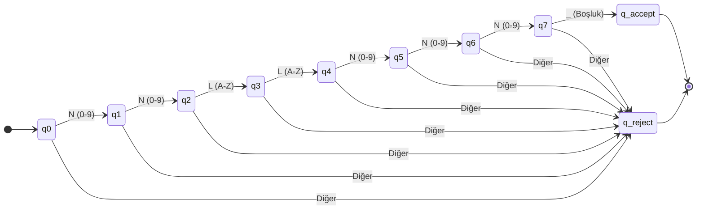

# Durum Geçiş Tablosu ve Diyagramı

Bu belgede Turing Makinesi'nin durumlar (states) arası nasıl geçiş yaptığı tablo ve diyagram olarak gösterilmektedir.

## Durum Geçiş Tablosu (State Transition Table)

| Mevcut Durum | Okunan Sembol | Yeni Durum | Yazılan Sembol (Bant) | Kafa Hareketi | Açıklama |
|---|---|---|---|---|---|
| **q0** | Rakam (0-9) | **q1** | *Aynı Kalır* | Sağ (R) | İlk rakam okundu |
| **q0** | Harf veya Diğer | **q_reject** | *Aynı Kalır* | Dur (-) | Hatalı format (RED) |
| **q1** | Rakam (0-9) | **q2** | *Aynı Kalır* | Sağ (R) | İkinci rakam okundu |
| **q1** | Harf veya Diğer | **q_reject** | *Aynı Kalır* | Dur (-) | Hatalı format (RED) |
| **q2** | Büyük Harf (A-Z) | **q3** | *Aynı Kalır* | Sağ (R) | İlk harf okundu |
| **q2** | Rakam veya Diğer | **q_reject** | *Aynı Kalır* | Dur (-) | Hatalı format (RED) |
| **q3** | Büyük Harf (A-Z) | **q4** | *Aynı Kalır* | Sağ (R) | İkinci harf okundu |
| **q3** | Rakam veya Diğer | **q_reject** | *Aynı Kalır* | Dur (-) | Hatalı format (RED) |
| **q4** | Rakam (0-9) | **q5** | *Aynı Kalır* | Sağ (R) | Üçüncü rakam okundu |
| **q4** | Harf veya Diğer | **q_reject** | *Aynı Kalır* | Dur (-) | Hatalı format (RED) |
| **q5** | Rakam (0-9) | **q6** | *Aynı Kalır* | Sağ (R) | Dördüncü rakam okundu |
| **q5** | Harf veya Diğer | **q_reject** | *Aynı Kalır* | Dur (-) | Hatalı format (RED) |
| **q6** | Rakam (0-9) | **q7** | *Aynı Kalır* | Sağ (R) | Beşinci rakam okundu |
| **q6** | Harf veya Diğer | **q_reject** | *Aynı Kalır* | Dur (-) | Hatalı format (RED) |
| **q7** | Boşluk (_) | **q_accept**| *Aynı Kalır* | Dur (-) | Format 7 haneli (KABUL) |
| **q7** | Rakam, Harf vb. | **q_reject**| *Aynı Kalır* | Dur (-) | Dizi fazla uzun (RED) |

## Durum Geçiş Diyagramı (State Transition Diagram)

